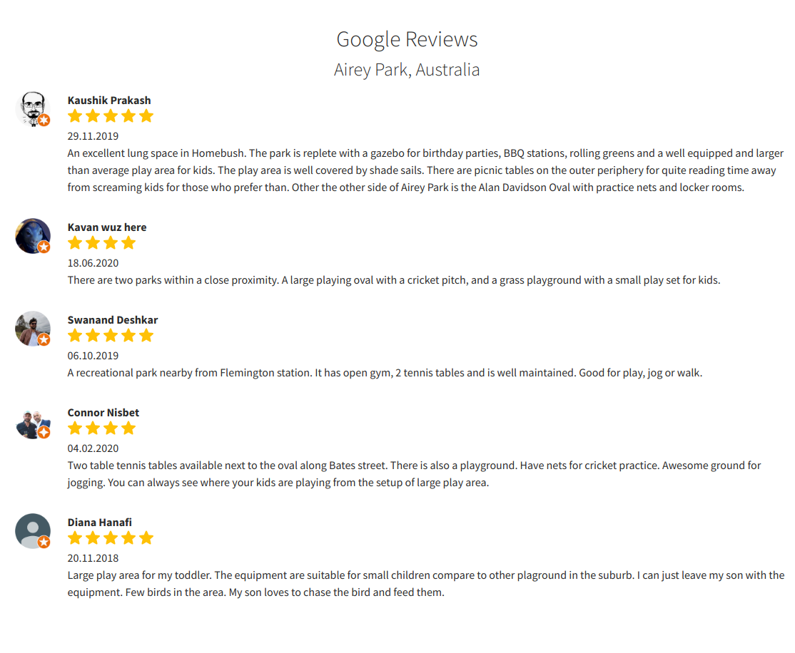
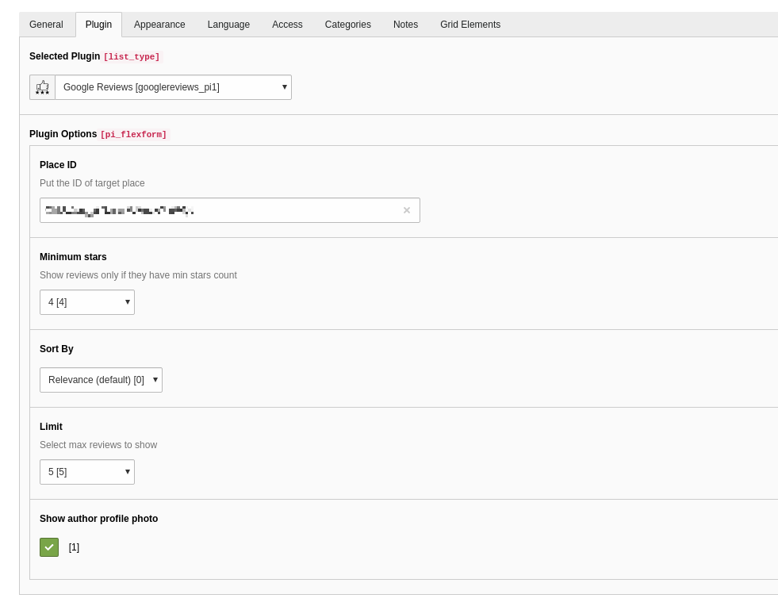
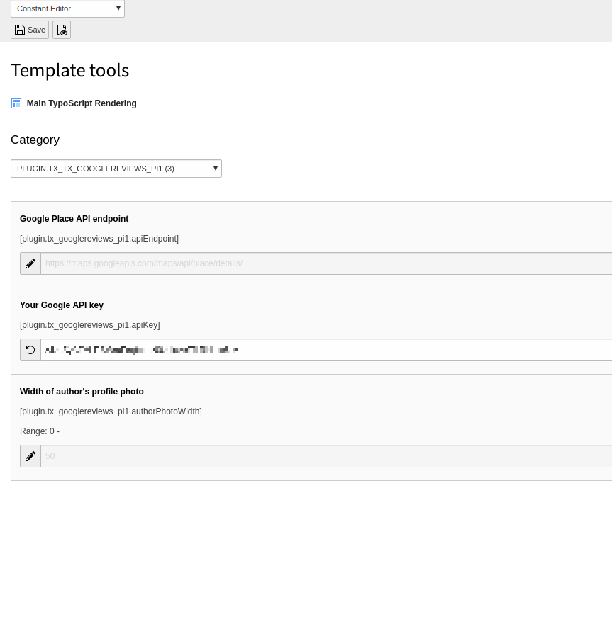

.. include:: ../Includes.txt

.. _introduction:

============
Introduction
============

What does it do?
================

Google Reviews extension to display Google business reviews on your website.
The simple TYPO3 extension that displays five (most-relevant) Google reviews according to selected Place ID.
Extension provides flexible configurations for better user experience.

Requirements
================
- PHP 7.x
- TYPO3 CMS 9.5.x - 10.4.x
- Google Maps API key, with Maps JavaScript API and Places API both enabled via your Google API console.

Warning
^^^^^^^^^
Reminder: To use the Maps JavaScript API, you must include an API key with all API requests and you must enable billing on each of your projects.
Please, read the conditions `Maps JavaScript API Usage and Billing <https://developers.google.com/maps/documentation/javascript/usage-and-billing>`__

.. _screenshots:

Screenshots
===========

Frontend
^^^^^^^^^

Plugin configurations
^^^^^^^^^

Plugin constants
^^^^^^^^^

- `Installation <https://github.com/ddoronenko/google-reviews/blob/master/Documentation/Installation/Index.rst>`__
- `Configuration <https://github.com/ddoronenko/google-reviews/blob/master/Documentation/Configuration/Index.rst>`__
